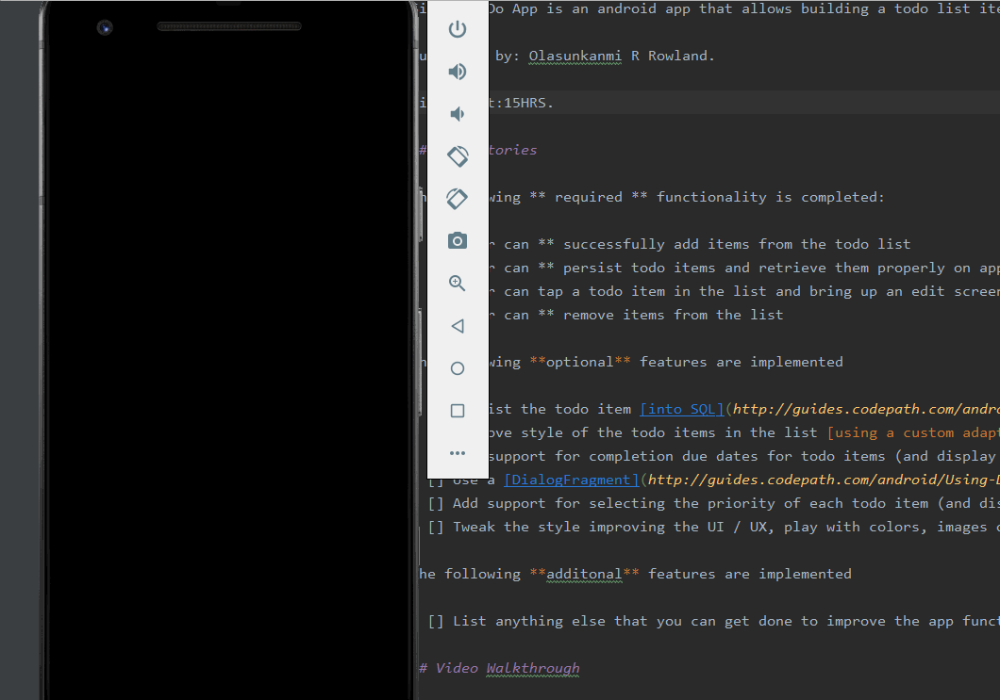

Pre-work - Simple ToDo App

Simple ToDo App is an android app that allows building a todo list item functionality including adding new items, editing, and deleting an existing item.

Submitted by: Olasunkanmi R Rowland.

Time Spent:15HRS.

## User Stories

The following ** required ** functionality is completed:

* [X] User can ** successfully add items from the todo list
* [X] User can ** persist todo items and retrieve them properly on app restart
* [x] User can tap a todo item in the list and bring up an edit screen for the todo item** and then have any changes to the list
* [x] User can ** remove items from the list 

The following **optional** features are implemented

* [] Persist the todo item [into SQL](http://guides.codepath.com/android/Persisting-Data-to-the-Device#sqlite) instead of a 
* [] Improve style of the todo items in the list [using a custom adapter](http://guides.codepath.com/android/Using-an-ArrayAdapter
* [] Add support for completion due dates for todo items (and display within listview item)
* [] Use a [DialogFragment](http://guides.codepath.com/android/Using-DialogFragment) instead of new Activity for editing items 
* [] Add support for selecting the priority of each todo item (and display in listview item)
* [] Tweak the style improving the UI / UX, play with colors, images or backgrounds

The following **additonal** features are implemented

* [] List anything else that you can get done to improve the app functionality

## Video Walkthrough

Here's a walkthrough of implemented user stories:

GIF created with [LiceCap](http://cockos.com/licecap/).

## Notes

Describe any challenges encountered while building the app.

* (Remove item code was implemented with N0 ERRORS BUT FUNCTIONALITY IS NOT SUCCESSFUL) causing additonal time to be spent trying to resolve functional issue before moving forward. Issue was resolved via Tech Fellow help.

* Updated to latest SDK & HAXM Version(s), but emulater still runs extremely slow making testing and running the code less productive due to efficiency constraints.

## License
Copyright [2020] [Olasunkanmi Rowland]

   Licensed under the Apache License, Version 2.0 (the "License");

   you may not use this file except in compliance with the License.

   You may obtain a copy of the License at

       http://www.apache.org/licenses/LICENSE-2.0

   Unless required by applicable law or agreed to in writing, software

   distributed under the License is distributed on an "AS IS" BASIS,

   WITHOUT WARRANTIES OR CONDITIONS OF ANY KIND, either express or implied.

   See the License for the specific language governing permissions and

   limitations under the License.

